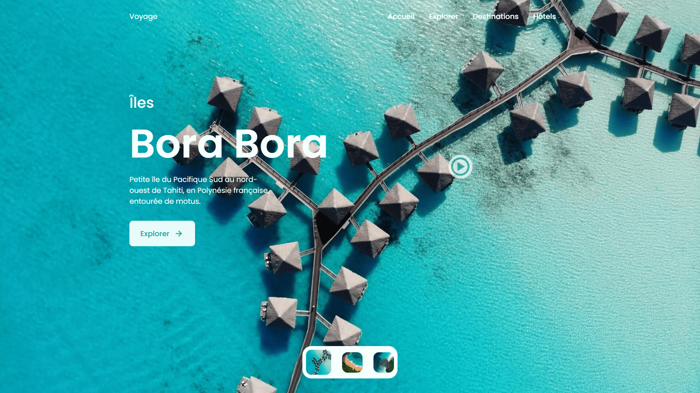

<div align="center">  
  <a href="https://background-slider-travel.netlify.app/" target="_blank">  
      
  </a>  
  </br></br>  
  <h3 align="center">🌴 Travel Slider – Îles & Évasion Visuelle</h3>  
</div>

## <br /> 📌 Sommaire

&nbsp;&nbsp;&nbsp; 🎨 &nbsp; [**Introduction**](#introduction)<br />
&nbsp;&nbsp;&nbsp; 🛠️ &nbsp; [**Technologies**](#technologies)<br />
&nbsp;&nbsp;&nbsp; 🎯 &nbsp; [**Fonctionnalités**](#fonctionnalités)<br />
&nbsp;&nbsp;&nbsp; 🚀 &nbsp; [**Installation**](#installation)<br />

## <br /> <a name="introduction">🎨 Introduction</a>

Slider immersif de destinations tropicales avec navigation fluide, animations GSAP et vidéos popup.

Parfait pour agences de voyage, sites de tourisme ou vitrines visuelles d’îles exotiques.

Chaque slide présente une île paradisiaque avec photo, texte et animation fluide.

## <br /> <a name="technologies">🛠️ Technologies</a>

- HTML5 sémantique
- CSS3 (animations, media queries, effets visuels)
- JavaScript ES6
- [Swiper.js](https://swiperjs.com/) pour slider principal + thumbnails
- [GSAP](https://greensock.com/gsap/) pour animations d’entrée
- Remix Icons & Boxicons

## <br /> <a name="fonctionnalités">🎯 Fonctionnalités</a>

- Slider avec effet fade entre les destinations
- Navigation thumbnail synchronisée
- Animation texte fluide via GSAP
- Popup vidéo pour chaque slide
- Design responsive 100% mobile
- Menu responsive avec toggle
- Slider contrôlable au clic
- Structure modulaire et scalable

## <br /> <a name="installation">🚀 Installation</a>

### ✅ Prérequis

- [Google Chrome](https://www.google.com/) — Navigateur moderne
- [Visual Studio Code](https://code.visualstudio.com/) — Éditeur de code
- [Live Server](https://marketplace.visualstudio.com/items?itemName=ritwickdey.LiveServer) — Extension VS Code

### 📥 Cloner le projet

```bash
git clone https://github.com/ValentinMadiot/background-slider-travel_js
cd background-slider-travel_js
```

### ▶️ Lancer le projet

Ouvre le fichier `index.html` dans ton navigateur, ou utilise **Live Server** pour un affichage fluide local.
